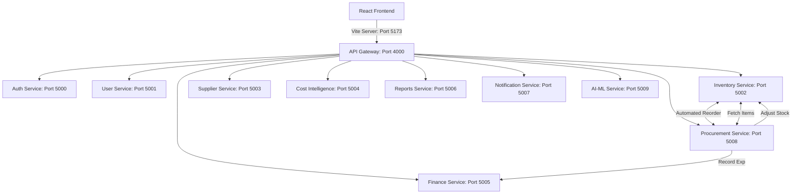

# 🌐 InsightNexus: Enterprise Resource Planning Hub

[](https://vite.dev/)
[](https://react.dev/)
[](https://nodejs.org/)
[](https://expressjs.com/)
[](https://www.mongodb.com/)
[](https://www.prisma.io/)

InsightNexus is a high-performance, real-time microservices-based Enterprise Resource Planning (ERP) platform. It provides modules for identity management, inventory adjustments, automated supplier restocking cycles, transaction ledgers, analytics reporting, and real-time activity alert dispatch.

---

## 🏗️ System Architecture & Services

The platform consists of **10 distinct backend microservices** coordinated through a central API Gateway and connected to a React/Vite frontend.



### Microservices Registry

| Service | Port | Database | Primary Responsibility |
| :--- | :--- | :--- | :--- |
| **API Gateway** | `4000` | — | Single entry point, JWT verification, reverse proxy routing |
| **Auth Service** | `5000` | MongoDB (`nexus_auth`) | User signup, login, password hashing, and token dispatch |
| **User Service** | `5001` | MongoDB (`nexus_user`) | Company details, manager promotions, employee list |
| **Inventory Service** | `5002` | MongoDB (`nexus_inventory`) | Product catalogs, stock history, and stock level tracking |
| **Supplier Service** | `5003` | MongoDB (`nexus_supplier`) | Supplier registry, performance tracking, best supplier selection |
| **Cost Intelligence** | `5004` | MongoDB (`nexus_cost`) | Expense tracking and optimization advice |
| **Finance Service** | `5005` | PostgreSQL (`nexus_finance`) | General ledger tracking, Runway & Burn Rate calculation |
| **Reports Service** | `5006` | MongoDB (`nexus_reports`) | Metrics aggregation and PDF/CSV exporter generation |
| **Notification Service**| `5007` | MongoDB (`nexus_notifications`)| Activity Center stream logs and low-stock alert dispatcher |
| **Procurement Service** | `5008` | MongoDB (`nexus_procurement`)| Purchase Orders, Expected Deliveries, status tracking |
| **AI Service** | `5009` | Python / SQLite | Intelligent demand forecasting & ML model analytics |

---

## 🔐 Role-Based Access Control (RBAC)

InsightNexus manages actions across three distinct employee access clearances:

| Role | Access Level | Permissions |
| :---: | :---: | :--- |
| **Admin** | 👑 Full Control | System configuration, database backups, member role changes, product deletion, and full ledger audits. |
| **Manager** | 🛠️ Operations | Stock adjustments, issuing manual Purchase Orders, adding suppliers, logging expenses, and viewing reports. |
| **Viewer** | 👁️ Read-Only | Viewing dashboards, tracking inventory levels, inspecting supplier lists, and browsing notifications. |

---

## ⚡ Quick Start & Installation

### 📋 Prerequisites
- **Node.js** (v18.0.0 or higher, Node v22+ recommended)
- **MongoDB** (Running locally on `mongodb://localhost:27017`)
- **PostgreSQL** (For the Finance service ledger)

### 🛠️ Step 1: Install Dependencies & Setup Environment
InsightNexus includes a PowerShell setup script that automatically installs node modules across all microservices and generates default `.env` files.

Run the following command from the root folder:
```bash
npm run install-all
```
*Alternatively, you can execute the PowerShell script directly:*
```powershell
powershell -ExecutionPolicy Bypass -File ./setup.ps1
```

### 🚀 Step 2: Start Services
You can spin up all the services simultaneously in your terminal. We support two methods:

#### Method A: Multi-Window Terminal (Recommended for Debugging)
Launches each service in a separate PowerShell window so you can monitor individual consoles:
```powershell
powershell -File run.ps1
```

#### Method B: Unified Terminal (Concurrently)
Launches all servers concurrently in a single terminal session:
```bash
npm run dev
```

The frontend will be available at: **`http://localhost:5173`**
The API Gateway handles requests at: **`http://localhost:4000`**

### 🌱 Step 3: Seed Sample Data
To populate the database collections with sample suppliers, inventory stock, transactions, and a pending purchase order, run the seed script:
```bash
node backend/server-1-core/auth-service/seed-sample-data.js
```

---

## 📦 Key Operations Flow

### Automated Procurement Cycle
1. **Low Stock Detection**: When an item's quantity falls below its configured `reorderLevel` (via usage updates or manual adjustments), the **Inventory Service** triggers a low stock event.
2. **Alert Dispatch**: A notification is sent to the **Notification Service** (`type: "low_stock"`), registering in the dashboard heartbeat.
3. **Auto-Restock PO**: The **Procurement Service** checks if there are active orders pending for that item. If none exist, it automatically requests a quote from the best-performing vendor via the **Supplier Service** and creates a pending **Purchase Order**.
4. **Replenishment**: When a manager transitions the PO status to `delivered`, the stock is replenished in the **Inventory Service**, and a corresponding expense is dispatched to the **Finance Service** ledger.

---

## 🛠️ Tech Stack & Styling
- **Frontend Core**: React 18, React Router v6, Framer Motion (animations), Lucide React (vector icons).
- **Styling**: Modern vanilla CSS variables (clean, light-theme palette featuring subtle glassmorphic elements).
- **Backend Core**: Node.js & Express (microservice architecture), Axios (service-to-service communication).
- **Database Access**: Mongoose ODM (MongoDB), Prisma ORM (PostgreSQL).
